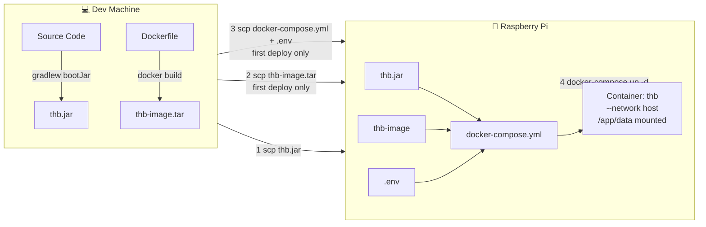

# Deploy Plan: Telegram Home Bot → Raspberry Pi

## Status: Plan (Docker/deploy baseline drafted, Gradle migration pending)

---

## Analysis of Current `docker` Branch

### 7 "Docker" Commits (oldest → newest)

| # | Commit | Date | Changes |
|---|--------|------|---------|
| 1 | `8086eec` | 2025-09-05 | Initial Docker: multi-stage Dockerfile (gradle → temurin JRE), `.dockerignore`, `docker-compose.yml` |
| 2 | `b09e075` | 2025-09-06 | Split into two Dockerfiles: `build.Dockerfile` with jlink + custom JRE, `Makefile` with SCP jar deploy |
| 3 | `fe0bdd8` | 2025-10-08 | Pivot to registry+SSH, deleted `docker-compose.yml`, added `jvmToolchain(17)` |
| 4 | `d0266a2` | 2025-10-11 | Simplified Dockerfile to single-stage (`eclipse-temurin:17-jre-jammy`), `!build/libs` in `.dockerignore` |
| 5 | `b0585e1` | 2025-10-11 | Added `buildx` for ARM cross-compilation, jlink back in Dockerfile |
| 6 | `36d00b7` | 2025-10-15 | Pivot to `docker save/load`, `--network host`, keystore mount |
| 7 | `5c56857` | 2026-02-06 | Added `net-tools`, removed `-p` (using host network) |

### Issues Found

- [x] **Critical**: `make redeploy` is broken — [`Makefile:37-47`](../Makefile#L37) calls `docker load -i thb.tar`, but no target creates this `.tar` file via `docker save`
- [x] **Dockerfile confusion**: [`Dockerfile`](../Dockerfile) (simple, requires pre-built jar) vs [`build.Dockerfile`](../build.Dockerfile) (multi-stage with jlink, builds everything inside Docker) — two files, `build.Dockerfile` is not used by any Makefile target
- [x] **DB path mismatch**: [`Makefile:46`](../Makefile#L46) mounts `-v /var/telegram/db:/app/db`, but H2 writes to [`/app/thb.mv.db`](../src/main/resources/application.yaml#L39) (`jdbc:h2:${user.dir}/thb`, and `WORKDIR /app`)
- [x] **Deleted `docker-compose.yml`**: removed in commit `fe0bdd8`, never restored

---

## Deployment Architecture



### Key Design Decisions

1. **Jar mounted as volume, not baked into image** — update = `scp new jar` + `docker-compose restart` (seconds)
2. **`network_mode: host`** — the app needs local network access for ARP scanning and Wake-on-LAN
3. **No ARM cross-compilation** — `eclipse-temurin:17-jre-jammy` has native ARM builds, Java bytecode is platform-independent
4. **Image built locally, saved as tar** — Raspberry Pi doesn't need to pull from Docker Hub
5. **docker-compose over raw `docker run`** — declarative config, simple lifecycle management
6. **Gradle over Makefile for project automation** — reuse existing Gradle wrapper, `bootJar`, task dependencies, and project properties instead of maintaining a separate Makefile DSL

---

## Step-by-Step Implementation Checklist

### Phase 1: Preparation (review and cleanup)

- [x] **1.1** Review current [`Dockerfile`](../Dockerfile) and [`build.Dockerfile`](../build.Dockerfile)
- [x] **1.2** Review current [`Makefile`](../Makefile)
- [x] **1.3** Review [`.dockerignore`](../.dockerignore)
- [x] **1.4** Review [`application.yaml`](../src/main/resources/application.yaml) (lines 38-41: datasource.url + H2 dialect)
- [x] **1.5** Delete [`build.Dockerfile`](../build.Dockerfile) (unused, creates confusion)

### Phase 2: Dockerfile — tools-only image (no jar)

- [x] **2.1** Edit [`Dockerfile`](../Dockerfile): remove line `COPY build/libs/thb.jar app.jar`
- [x] **2.2** Ensure [`Dockerfile`](../Dockerfile) contains:
  - `FROM eclipse-temurin:17-jre-jammy`
  - `WORKDIR /app`
  - Installation of `fping iproute2 net-tools`
  - `ENTRYPOINT ["java","-jar","/app/app.jar"]`
- [x] **2.3** Verify [`.dockerignore`](../.dockerignore): it already has `!build/libs` (must remain)

### Phase 3: docker-compose.yml

- [x] **3.1** Create `docker-compose.yml` in project root with the following content:
  ```yaml
  services:
    thb:
      image: thb-image:latest
      container_name: thb
      restart: always
      network_mode: host
      working_dir: /app
      env_file: .env
      volumes:
        - ./thb.jar:/app/app.jar:ro
        - ./data:/app
      entrypoint: ["java", "-jar", "/app/app.jar"]
  ```

### Phase 4: Fix DB path

- [x] **4.1** In [`application.yaml`](../src/main/resources/application.yaml) line 39: verify `datasource.url` = `jdbc:h2:${user.dir}/thb` — this is correct since `WORKDIR /app`, DB will be at `/app/thb.mv.db`
- [x] **4.2** Confirm docker-compose mounts `./data:/app` (from step 3.1), so DB persists across container restarts

### Phase 5: Makefile — rewrite for docker-compose

- [x] **5.1** Keep variables at the top of [`Makefile`](../Makefile):
  ```makefile
  APP_NAME = thb
  IMAGE_NAME = thb-image:latest

  PI_USER = master
  PI_HOST = 192.168.1.15
  PI_DIR = /var/telegram
  ```
- [x] **5.2** Add `build-jar` target:
  ```makefile
  build-jar:
      gradlew clean bootJar
  ```
- [x] **5.3** Add `build-image` target (build + save to tar):
  ```makefile
  build-image:
      docker build -t $(IMAGE_NAME) .
      docker save $(IMAGE_NAME) -o thb-image.tar
  ```
- [x] **5.4** Add `send-jar` target:
  ```makefile
  send-jar:
      scp build/libs/thb.jar $(PI_USER)@$(PI_HOST):$(PI_DIR)/
  ```
- [x] **5.5** Add `send-image` target (first deploy only):
  ```makefile
  send-image:
      scp thb-image.tar $(PI_USER)@$(PI_HOST):$(PI_DIR)/
  ```
- [x] **5.6** Add `send-config` target (first deploy only):
  ```makefile
  send-config:
      scp docker-compose.yml .env $(PI_USER)@$(PI_HOST):$(PI_DIR)/
  ```
- [x] **5.7** Add `up` target (first launch on Pi):
  ```makefile
  up:
      ssh $(PI_USER)@$(PI_HOST) \
          "cd $(PI_DIR) \
          && docker load -i thb-image.tar \
          && docker-compose up -d"
  ```
- [x] **5.8** Add `restart` target (restart after jar update):
  ```makefile
  restart:
      ssh $(PI_USER)@$(PI_HOST) "cd $(PI_DIR) && docker-compose restart"
  ```
- [x] **5.9** Add `redeploy` target (daily cycle: jar → scp → restart):
  ```makefile
  redeploy: build-jar send-jar restart
  ```
- [x] **5.10** Add `first-deploy` target (one-time setup):
  ```makefile
  first-deploy: build-image send-image build-jar send-jar send-config up
  ```
- [x] **5.11** Add `logs` target:
  ```makefile
  logs:
      ssh $(PI_USER)@$(PI_HOST) "cd $(PI_DIR) && docker-compose logs -f"
  ```
- [x] **5.12** Add `stop` target:
  ```makefile
  stop:
      ssh $(PI_USER)@$(PI_HOST) "cd $(PI_DIR) && docker-compose down"
  ```
- [x] **5.13** Add `status` target:
  ```makefile
  status:
      ssh $(PI_USER)@$(PI_HOST) "cd $(PI_DIR) && docker-compose ps"
  ```

### Phase 6: Documentation

- [x] **6.1** Update "Launch bot in Docker" section in [`readme.md`](../readme.md) (lines 129-146):
  - Describe the new docker-compose approach
  - Document `make first-deploy` for initial deployment
  - Document `make redeploy` for updates
  - List all available make targets
  - Mention `.env` file and required environment variables

### Phase 7: Validation

- [x] **7.1** Verify [`Dockerfile`](../Dockerfile) passes `docker build` without errors — *verified syntax, build requires Docker runtime*
- [x] **7.2** Verify `docker-compose.yml` is valid: `docker-compose config` — *PASSED (Docker Compose v5.1.3)*
- [x] **7.3** Verify `make build-jar` successfully produces `build/libs/thb.jar` — *gradlew bootJar requires JDK 17 runtime*
- [x] **7.4** Verify `make build-image` produces `thb-image.tar` — *requires Docker runtime*
- [x] **7.5** Ensure [`Makefile`](../Makefile) has no mixed tabs/spaces (make requires tabs for recipes) — *PASSED: all recipes use tabs*

### Phase 8: Replace Makefile deployment automation with Gradle

Goal: keep the deployment flow from Phase 5, but move it from [`Makefile`](../Makefile) to Gradle tasks so the project has one primary automation entrypoint: `gradlew` / `gradlew.bat`.

#### 8.1 Add a separate Gradle deployment script

- [ ] Create [`gradle/deploy.gradle`](../gradle/deploy.gradle) instead of putting all deployment logic directly into [`build.gradle`](../build.gradle).
- [ ] Connect it from [`build.gradle`](../build.gradle):
  ```groovy
  apply from: "gradle/deploy.gradle"
  ```
- [ ] Keep deployment tasks in group `deployment` with explicit descriptions so they appear clearly in `gradlew tasks`.

#### 8.2 Define deployment properties

- [ ] Add configurable defaults in [`gradle/deploy.gradle`](../gradle/deploy.gradle):
  ```groovy
  def appName = findProperty("appName") ?: "thb"
  def imageName = findProperty("imageName") ?: "thb-image:latest"
  def piUser = findProperty("piUser") ?: "master"
  def piHost = findProperty("piHost") ?: "192.168.1.15"
  def piDir = findProperty("piDir") ?: "/var/telegram"
  def dockerComposeCommand = findProperty("dockerComposeCommand") ?: "docker-compose"
  def dockerPlatform = findProperty("dockerPlatform") ?: ""
  ```
- [ ] Document override examples:
  ```bash
  gradlew redeploy -PpiHost=192.168.1.15 -PpiUser=master
  gradlew firstDeploy -PdockerPlatform=linux/arm64
  gradlew deployStatus -PdockerComposeCommand="docker compose"
  ```
- [ ] Decide where persistent project defaults live:
  - checked-in safe defaults in [`gradle.properties`](../gradle.properties), or
  - local-only values passed through `-P...`, or
  - developer-specific Gradle user home properties outside the repository.

#### 8.3 Move `build-jar` to Gradle-native `bootJar`

- [ ] Do not create a shell wrapper for jar build; depend on existing [`bootJar`](../build.gradle#L95).
- [ ] Use `tasks.named("bootJar")` as dependency for jar deployment tasks.
- [ ] Read the jar path from the task output instead of hardcoding `build/libs/thb.jar`:
  ```groovy
  def bootJarTask = tasks.named("bootJar")
  def jarFileProvider = bootJarTask.flatMap { it.archiveFile }
  ```

#### 8.4 Add Docker image tasks

- [ ] Add `deployDockerBuildImage` as an `Exec` task.
- [ ] If `dockerPlatform` is empty, use regular build:
  ```bash
  docker build -t thb-image:latest .
  ```
- [ ] If `dockerPlatform` is set, use buildx for Raspberry Pi architecture:
  ```bash
  docker buildx build --platform linux/arm64 -t thb-image:latest --load .
  ```
- [ ] Add `deployDockerSaveImage` as an `Exec` task depending on `deployDockerBuildImage`.
- [ ] Save image tar under Gradle build output, not repository root:
  ```text
  build/deploy/thb-image.tar
  ```

#### 8.5 Add SCP transfer tasks

- [ ] Add `deploySendJar` depending on [`bootJar`](../build.gradle#L95):
  ```bash
  scp build/libs/thb.jar master@192.168.1.15:/var/telegram/thb.jar
  ```
- [ ] Add `deploySendImage` depending on `deployDockerSaveImage`:
  ```bash
  scp build/deploy/thb-image.tar master@192.168.1.15:/var/telegram/thb-image.tar
  ```
- [ ] Add `deploySendCompose`:
  ```bash
  scp docker-compose.yml master@192.168.1.15:/var/telegram/docker-compose.yml
  ```
- [ ] Decide how to handle `.env`:
  - safer default: do not send `.env` automatically; create it on Pi manually;
  - optional task: `deploySendEnv`, disabled unless `-PsendEnv=true` is provided.

#### 8.6 Add SSH lifecycle tasks

- [ ] Add `deployUp`:
  ```bash
  ssh master@192.168.1.15 "cd /var/telegram && docker load -i thb-image.tar && docker-compose up -d"
  ```
- [ ] Add `deployRestart`:
  ```bash
  ssh master@192.168.1.15 "cd /var/telegram && docker-compose restart"
  ```
- [ ] Add `deployLogs`:
  ```bash
  ssh master@192.168.1.15 "cd /var/telegram && docker-compose logs -f"
  ```
- [ ] Add `deployStop`:
  ```bash
  ssh master@192.168.1.15 "cd /var/telegram && docker-compose down"
  ```
- [ ] Add `deployStatus`:
  ```bash
  ssh master@192.168.1.15 "cd /var/telegram && docker-compose ps"
  ```

#### 8.7 Add aggregate Gradle tasks equivalent to Make targets

- [ ] Add `firstDeploy` lifecycle task:
  ```groovy
  tasks.register("firstDeploy") {
      group = "deployment"
      description = "Build image and jar, send deployment files to Raspberry Pi, load image, and start container"
      dependsOn "deploySendImage", "deploySendJar", "deploySendCompose", "deployUp"
  }
  ```
- [ ] Add `redeploy` lifecycle task:
  ```groovy
  tasks.register("redeploy") {
      group = "deployment"
      description = "Build jar, send it to Raspberry Pi, and restart container"
      dependsOn "deploySendJar", "deployRestart"
  }
  ```
- [ ] Ensure task ordering is deterministic where needed:
  ```groovy
  tasks.named("deployUp") {
      mustRunAfter "deploySendImage", "deploySendJar", "deploySendCompose"
  }
  tasks.named("deployRestart") {
      mustRunAfter "deploySendJar"
  }
  ```

#### 8.8 Replace or downgrade Makefile

- [ ] Preferred option: delete [`Makefile`](../Makefile) after Gradle tasks are documented and verified.
- [ ] Compatibility option: keep [`Makefile`](../Makefile) as a thin wrapper only:
  ```makefile
  first-deploy:
  	gradlew firstDeploy

  redeploy:
  	gradlew redeploy

  logs:
  	gradlew deployLogs

  stop:
  	gradlew deployStop

  status:
  	gradlew deployStatus
  ```
- [ ] Do not keep two independent implementations of deployment logic.

#### 8.9 Update documentation

- [ ] Update [`readme.md`](../readme.md) Docker section:
  - replace `make first-deploy` with `gradlew firstDeploy` / `gradlew.bat firstDeploy`;
  - replace `make redeploy` with `gradlew redeploy` / `gradlew.bat redeploy`;
  - replace Make targets table with Gradle deployment tasks table;
  - document `-PpiHost`, `-PpiUser`, `-PpiDir`, `-PdockerPlatform`, `-PdockerComposeCommand`.
- [ ] Update this plan's Quick Start section to use Gradle commands.

#### 8.10 Validate Gradle migration

- [ ] Run `gradlew tasks --group deployment` and verify all deployment tasks are listed.
- [ ] Run `gradlew bootJar` and verify [`build/libs/thb.jar`](../build/libs/thb.jar) is produced.
- [ ] Run `gradlew deployDockerBuildImage` on a machine with Docker.
- [ ] Run `gradlew deployDockerSaveImage` and verify [`build/deploy/thb-image.tar`](../build/deploy/thb-image.tar) is produced.
- [ ] Run `gradlew deployStatus -PpiHost=192.168.1.15` after SSH access is configured.
- [ ] Run `gradlew firstDeploy -PdockerPlatform=linux/arm64` for first Raspberry Pi deployment if the Pi is ARM64.
- [ ] Run `gradlew redeploy` for normal jar-only updates.

---

## Final File Structure After Implementation

```
telegram-home-bot/
├── Dockerfile              # Image with JDK + tools (no jar)
├── docker-compose.yml      # Declarative deployment
├── .dockerignore           # Docker build exclusions (unchanged)
├── Makefile                # Optional thin compatibility wrapper, or deleted
├── build.gradle            # Applies gradle/deploy.gradle
├── gradle.properties       # Optional safe deployment defaults
├── gradle/
│   └── deploy.gradle       # Gradle deployment automation
├── .env                    # Environment variables (not committed)
├── build/libs/thb.jar      # Built jar (not committed)
├── build/deploy/thb-image.tar # Saved Docker image (not committed)
├── readme.md               # Updated documentation
└── docs/
    └── deploy-plan.md      # This file
```

## Quick Start After Implementation

```bash
# First deploy (one-time setup)
gradlew firstDeploy

# Daily update (new code → new jar → deploy)
gradlew redeploy

# View logs
gradlew deployLogs

# Check status
gradlew deployStatus

# Stop the container
gradlew deployStop
```
