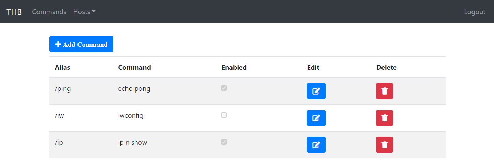
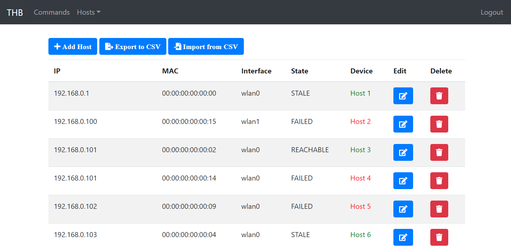
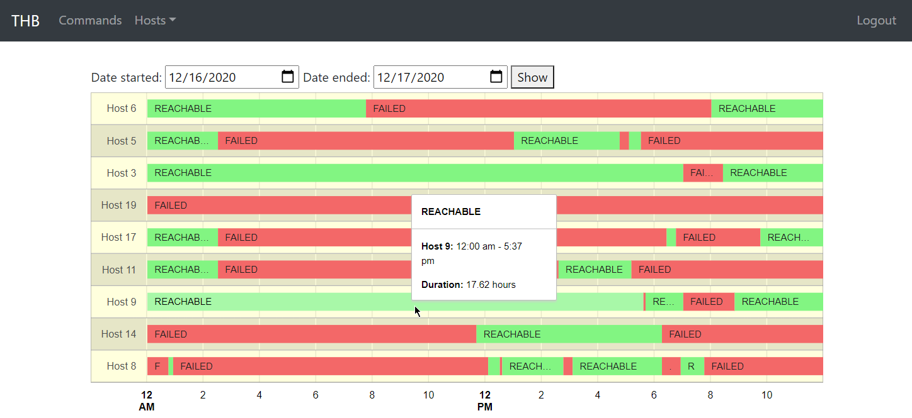

[](https://circleci.com/gh/Shterneregen/telegram-home-bot)

# Telegram Home Bot

Can be used for home automation on Raspberry Pi

To use this project set environment variables for TELEGRAM_BOT_CHAT_ID, TELEGRAM_TOKEN and TELEGRAM_BOT_NAME.  
(Actually, using THB as a Linux service, I just put the properties files next to the jar file and also set the telegram
credentials into the application.properties without using env variables)

### Create telegram chatbot

* start a chat with __@BotFather__
* use message __/newbot__
* set bot name (TELEGRAM_BOT_NAME)
* set unique bot username (ends with _bot or Bot)
* get __token__ from the final message (TELEGRAM_TOKEN)
* start conversation with bot
* retrieve __chat_id__, call https://api.telegram.org/bot[YOUR_TOKEN]/getUpdates (TELEGRAM_BOT_CHAT_ID)

1. Periodically calls a command (_state.change.command_) to check network changes and in case of state changes sends a
   message to telegram bot (only to TELEGRAM_BOT_CHAT_ID)
2. You can add any commands in [commands.properties](src/main/resources/commands.properties). These commands work for
   TELEGRAM_BOT_CHAT_ID and users from __home.group.user.ids__ list

### [Installation as an init.d Service](https://docs.spring.io/spring-boot/docs/current/reference/htmlsingle/#deployment-initd-service)

* `gradlew clean bootJar`
* Copy a jar file to SOME_LINUX_FOLDER on linux machine

* On linux machine:

```shell
sudo mkdir /var/telegram # create a folder for jar file
sudo cp /SOME_LINUX_FOLDER/thb.jar /var/telegram/thb.jar # copy jar to the folder
sudo ln -s /var/telegram/thb.jar /etc/init.d/thb # create symlink the jar to init.d
sudo chmod +x /var/telegram/thb.jar # make thb.jar executable
sudo systemctl daemon-reload # reload systemd manager configuration
sudo service thb start # start bot as a service
update-rc.d thb defaults # autostart
```

### Enable HTTPS

This example will be with a self-signed certificate on the local machine

* Create `thb-keystore.p12`

```shell
keytool -genkeypair -alias thb -keyalg RSA -keysize 2048 -storetype PKCS12 -keystore thb-keystore.p12 -validity 3650 -ext san=ip:127.0.0.1
```

* Enter `SOME_SECURE_PSW` for keystore
* Uncomment `server.ssl.*` properties in the [application.properties](src/main/resources/application.properties)
  file (put your `SOME_SECURE_PSW` and change others if needed)
* Add `thb-keystore.p12` to the `Trusted Root Certification Authorities certificate` store

### Launch bot in Docker

```shell
# Build the image
docker build -t thb-image .

# Create and start new container from the image
docker run -d -p 80:8080 --network=bridge --name=thb  thb-image

# Start the container
docker start thb

# Stop the running container
docker stop thb

# Show information logged by a running container
docker logs -f thb
```

### Launch SonarQube in Docker

- Run SonarQube container

```shell
docker run -d --name sonarqube -p 9000:9000 -p 9092:9092 sonarqube
```

- Browse http://127.0.0.1:9000. Initial credentials: `admin / admin`
- Change password
- Create project with name `thb`
- Create project token
- Run `sonarqube` task

```shell
gradlew sonarqube -Dsonar.projectKey=thb -Dsonar.host.url=http://127.0.0.1:9000 -Dsonar.login=PROJECT_TOKEN
```

---

#### Create private chat group with chatbot (JFYI)

* open a session with __@BotFather__
* enter __/setjoingroups__
* enter the name of the bot
* enter Disable
* get private group __chat_id__, call https://api.telegram.org/bot$TOKEN/getUpdates

### Preview







---

Spring Boot, Kotlin, Spring Security, Gradle, H2, Thymeleaf, Google Charts, telegrambots-spring-boot-starter
