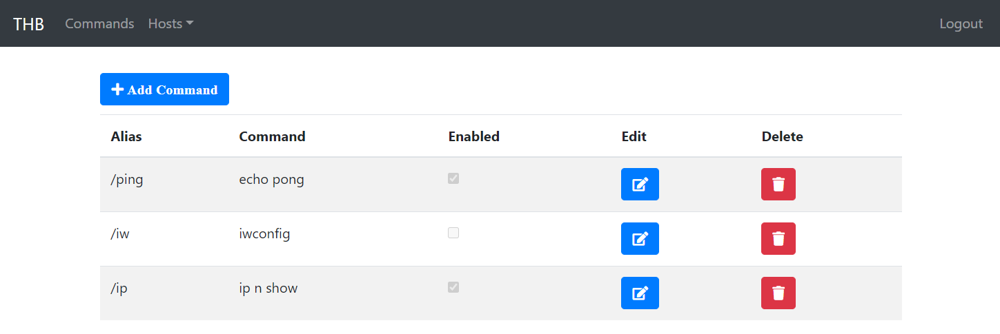
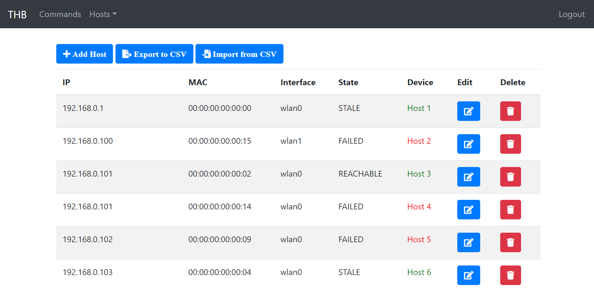
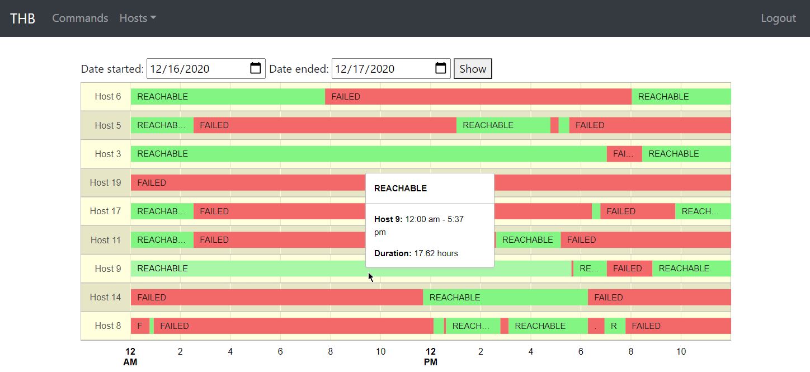

# Telegram Home Bot

Can be used for home automation on Raspberry Pi

## What can this bot do?

- Monitor local network and notify about hosts appearances/disappearances via Telegram client
- Run commands on target machine from Telegram client
- Wake-up selected hosts via WOL technology sending magic packet using Telegram client
- Provide weather info for chosen places using OpenWeatherMap API via Telegram client

Application settings are stored in [application.properties](src/main/resources/application.properties) file

## How to set up the project

### Create telegram chatbot

- Start a chat with **@BotFather**
- Use message **/newbot**
- Set unique bot name (ends with `_bot` or `Bot`, use it as **telegram.bot-name**)
- Get **token** from the final message (and use it as **telegram.token**)
- Start conversation with bot
- Retrieve **chat_id**, call https://api.telegram.org/bot[YOUR_TOKEN]/getUpdates
  (and use it as **TELEGRAM_BOT_CHAT_ID** env variable)

### Admin site in browser

- Located by default on http://127.0.0.1:9988/
    - Port setting: `server.port`
- Default users: `admin / 1234`, `user / 1234`
    - Default credentials could be changed in settings:
      `default.admin.login / default.admin.password`, `default.user.login / default.user.password`
- Password could be changed on http://127.0.0.1:9988/updatePassword page

### Enable network monitor

- Set `NETWORK_MONITOR_ENABLED` env var to `true`
- You can observe/add/edit hosts on http://127.0.0.1:9988/hosts page
- Hosts availability changes is on http://127.0.0.1:9988/hosts/time-log page
- Unfortunately, current implementation is based on `ip -j n show` and some other native calls, so you have to
  install `iproute2` and `fping`on Linux machine where chatbot is running. See [Dockerfile](Dockerfile)
- This feature does not work on Windows
- To enable/disable host notifications, run the `/features` command in the Telegram client and choose what you want

#### What does network monitor do?

- Periodically calls a command (**STATE_CHANGE_COMMAND**) to check network changes
- Chatbot notifies about hosts appearances/disappearances **TELEGRAM_BOT_CHAT_ID** user

### Run commands on chatbot machine

- You can add any initial commands that will be available to run
  in [commands.properties](src/main/resources/commands.properties) file
- Besides, you can add/edit commands on http://127.0.0.1:9988/commands page
- To hide any command from the Telegram client, uncheck the `Enabled` checkbox on the Command editing page
- In the Telegram client these commands will be available as a reply markup

### Wake On Lan feature

- Modify `WAKE_ON_LAN_BROADCAST_IP` env var according to your network mask
- To enable WOL for a host open http://127.0.0.1:9988/hosts page
- Choose a host and check `Wake On Lan Enabled` checkbox
- To wake up a host, run `/wol` in the Telegram client and select the one you want

### Enable Weather menu

- Set `OPENWEATHER_ENABLED` env variable to `true`
- Generate you API key on https://home.openweathermap.org/api_keys page
- Set the API key above as `OPENWEATHER_APPID` env variable
- Add places where you want to know the weather on http://127.0.0.1:9988/weather page
    - Don't add `city ID` with `lat & lon` in the same time, use them separately
    - City ID could be found in [city.list.json.gz](http://bulk.openweathermap.org/sample/city.list.json.gz)
      or [city.list.min.json.gz](http://bulk.openweathermap.org/sample/city.list.min.json.gz)
- After starting the app you can reach the Weather menu using `/weather` command via Telegram client
- Please note that the free subscription includes: 60 calls/minute, 1 000 000 calls/month
  ([Pricing](https://openweathermap.org/price))
- Useful links
    - [Weather API](https://openweathermap.org/api)
    - [Current weather data](https://openweathermap.org/current)
    - [Index of /sample/](http://bulk.openweathermap.org/sample/)

### List of chatbot commands

- `/menu` - Main menu
- `/features` - Features Setting (notification settings for now)
- `/wol` - Wake On Lan hosts
- `/weather` - Weather

---

## Additional information

### [Installation as an init.d Service](https://docs.spring.io/spring-boot/docs/current/reference/htmlsingle/#deployment-initd-service)

- Run `gradlew clean bootJar` in the project root folder
- Executable jar will be placed here: `build/libs/thb.jar`
- Copy the jar file to SOME_LINUX_FOLDER on Linux machine

- Run on Linux machine:

```shell
sudo mkdir /var/telegram # create a folder for jar file
sudo cp /SOME_LINUX_FOLDER/thb.jar /var/telegram/thb.jar # copy jar to the folder
sudo ln -s /var/telegram/thb.jar /etc/init.d/thb # create symlink the jar to init.d
sudo chmod +x /var/telegram/thb.jar # make thb.jar executable
sudo chown -R $USER:$USER /var/telegram
sudo chmod 755 /var/telegram
sudo systemctl daemon-reload # reload systemd manager configuration
sudo service thb start # start bot as a service
update-rc.d thb defaults # autostart
```

- When I'm using THB as a Linux service, I just put the `.env` file (with all necessary props) next to the jar file

### Enable HTTPS

The example below will be with a self-signed certificate on the local machine

- Create `thb-keystore.p12`

```shell
keytool -genkeypair -alias thb -keyalg RSA -keysize 2048 -storetype PKCS12 -keystore thb-keystore.p12 -validity 3650 -ext san=ip:127.0.0.1
```

- You will be asked to enter a password for the keystore
- Set your password as *SSL_KEY_STORE_PASSWORD** property and change other props if necessary
- Add `thb-keystore.p12` to the `Trusted Root Certification Authorities certificate` store (Windows)

### Launch bot in Docker (docker-compose)

#### Prerequisites

- Docker and docker-compose installed on the target machine
- SSH access to Raspberry Pi (or any Linux host)
- `.env` file configured with required variables (see below)

#### Required `.env` variables

```env
TELEGRAM_ENABLED=true
TELEGRAM_TOKEN=your_telegram_bot_token
TELEGRAM_BOT_CHAT_ID=your_chat_id
NETWORK_MONITOR_ENABLED=true
OPENWEATHER_ENABLED=false
```

#### First deploy (one-time setup)

```bash
# Build everything and deploy to Raspberry Pi
gradlew firstDeploy

# For ARM64 Raspberry Pi, specify the platform:
gradlew firstDeploy -PdockerPlatform=linux/arm64
```

This will:
1. Build a Docker image with JDK 17 + network tools (fping, iproute2, net-tools)
2. Save the image as `build/deploy/thb-image.tar`
3. Build `thb.jar` via `gradlew bootJar`
4. Create the remote deployment directory if it does not exist
5. SCP jar, image, and `docker-compose.yml` to the Pi
6. Load the image and start the container via `docker-compose up -d`

> **Note:** `.env` is not sent automatically for security. Create it manually on the Pi, or use `gradlew deploySendEnv -PsendEnv=true`.

#### Daily update (new code → deploy)

```bash
# Build jar, send to Pi, restart container
gradlew redeploy
```

#### Gradle deployment tasks

All deployment logic is in [`gradle/deploy.gradle`](gradle/deploy.gradle). Run `gradlew tasks --group deployment` to list them.

| Command | Description |
|---------|-------------|
| `gradlew bootJar` | Build `thb.jar` locally |
| `gradlew deployDockerBuildImage` | Build Docker image (add `-PdockerPlatform=linux/arm64` for ARM) |
| `gradlew deployDockerSaveImage` | Save Docker image as `build/deploy/thb-image.tar` |
| `gradlew deployPrepareRemote` | Create deployment directory on Raspberry Pi |
| `gradlew deploySendJar` | SCP jar to Raspberry Pi |
| `gradlew deploySendImage` | SCP Docker image tar to Raspberry Pi |
| `gradlew deploySendCompose` | SCP `docker-compose.yml` to Raspberry Pi |
| `gradlew deploySendEnv -PsendEnv=true` | SCP `.env` to Raspberry Pi (opt-in) |
| `gradlew deployUp` | Load image and start container on Raspberry Pi |
| `gradlew deployRestart` | Restart container on Raspberry Pi |
| `gradlew redeploy` | Daily update: build jar → send → restart |
| `gradlew firstDeploy` | First deploy: build image + jar → send all → start |
| `gradlew deployLogs` | Stream container logs from Raspberry Pi |
| `gradlew deployStop` | Stop container on Raspberry Pi |
| `gradlew deployStatus` | Check container status on Raspberry Pi |

#### Overridable properties

Customize deployment via `-P` flags (defaults shown):

| Property | Default | Description |
|----------|---------|-------------|
| `-PpiHost=192.168.1.15` | `192.168.1.15` | Raspberry Pi IP / hostname |
| `-PpiUser=master` | `master` | SSH user on the Pi |
| `-PpiDir=/var/telegram` | `/var/telegram` | Deployment directory on the Pi |
| `-PimageName=thb-image:latest` | `thb-image:latest` | Docker image tag to build, save, and load |
| `-PdockerPlatform=` | _(empty)_ | Set to `linux/arm64` for ARM cross-compile |
| `-PdockerComposeCommand=docker-compose` | `docker-compose` | Docker Compose binary (use `docker compose` for plugin) |
| `-PsendEnv=true` | _(unset)_ | Allow `deploySendEnv` to copy local `.env` to the Pi |

Example with custom host and user:

```bash
gradlew redeploy -PpiHost=192.168.1.100 -PpiUser=pi
gradlew deployStatus -PpiHost=192.168.1.100 -PpiUser=pi
```

#### Makefile compatibility wrapper

A thin [`Makefile`](Makefile) is kept for convenience, delegating to Gradle:

```bash
make redeploy      # → gradlew redeploy
make first-deploy  # → gradlew firstDeploy
make logs          # → gradlew deployLogs
make stop          # → gradlew deployStop
make status        # → gradlew deployStatus
```

Use `gradlew` / `gradlew.bat` directly for full control, especially `-P` property overrides.

#### Architecture

- **Jar is mounted as a volume**, not baked into the image — updates only need a new jar + restart
- **`network_mode: host`** — required for ARP scanning and Wake-on-LAN
- **Database** persists in `./data/` directory on the Pi (mounted to `/app/data` in container, with `DB_URL=jdbc:h2:/app/data/thb` by default)
- **Image** is built once (contains JDK + tools), jar is updated independently

### Launch SonarQube in Docker

- Run SonarQube container

```shell
docker run -d --name sonarqube -p 9000:9000 -p 9092:9092 sonarqube
```

- Browse http://127.0.0.1:9000. Initial credentials: `admin / admin`
- Change password
- Create project with name `thb`
- Create project token
- Run `sonarqube` task

```shell
gradlew sonarqube -Dsonar.projectKey=thb -Dsonar.host.url=http://127.0.0.1:9000 -Dsonar.login=PROJECT_TOKEN
```

### Create private chat group with chatbot (JFYI)

- open a session with **@BotFather**
- enter **/setjoingroups**
- enter the name of the bot
- enter Disable
- get private group **chat_id**, call https://api.telegram.org/bot$TOKEN/getUpdates

---

## Preview (outdated)







---

Kotlin, Spring (Boot/Security/WebFlux), Gradle, H2, Thymeleaf, Google Charts, telegrambots-springboot-longpolling-starter
